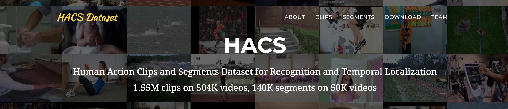

# HACS-dataset



This project introduces a novel video dataset, named HACS (Human Action Clips and Segments). It consists of two kinds of manual annotations. HACS Clips contains 1.55M 2-second clip annotations; HACS Segments has complete action segments (from action start to end) on 50K videos. The large-scale dataset is effective for pretraining action recognition and localization models, and also serves as a new benchmark for temporal action localization. (*SLAC dataset is now part of HACS dataset.)

Project Website: http://hacs.csail.mit.edu/

Paper: https://arxiv.org/abs/1712.09374

### *Updates on v1.1.1
A minor change comparing to v1.1: we remove some invalid videos from the dataset.

## Download Annotation Files
1. Clone this repository:
```
git clone https://github.com/hangzhaomit/HACS-dataset.git
```
2. Unzip annotation files:
```
unzip HACS_v1.1.1.zip
```
3. Check dataset statistics:
```
python dataset_stats.py
```
&nbsp;&nbsp; You should expect the following output:
```
====Parsing clips====
[training set]: 492748 videos, 1509478 clips
[validation set]: 5981 videos, 20245 clips
[testing set]: 5987 videos, 20293 clips
====Parsing segments====
[training set]: 37613 videos
[validation set]: 5981 videos
[testing set]: 5987 videos
Done.
```

## Annotation File Format
1. For HACS Clips, the annotation file is ```HACS_v1.1.1/HACS_clips_v1.1.1.csv```. ```"label": 1```/```"label": -1``` refers to positive/negative sample. The format looks like the following:
```
classname,youtube_id,subset,start,end,label
Archery,a2X2hz1G6i8,training,15.5,17.5,1
Archery,NUdji_CqvcY,training,77.5,79.5,-1
Archery,0O_qMHxBfXg,training,24.5,26.5,-1
...
```

2. For HACS Segments, the annotation file is ```HACS_v1.1.1/HACS_segments_v1.1.1.json```, with the same format as ActivityNet dataset:
```
{
  "database": {
    "--0edUL8zmA": {
        "annotations": [
            {"label": "Dodgeball", "segment": [5.40, 11.60]},
            {"label": "Dodgeball", "segment": [12.60, 88.16]},
        "subset": "training",
        "duration": "92.166667",
        "url": "https://www.youtube.com/watch?v=--0edUL8zmA"
    },
  ...
  },
}
```

## Download Videos
1. Install the following libraries:

-  youtube-dl (https://github.com/rg3/youtube-dl), make sure it is up-to-date.

-  FFmpeg (https://www.ffmpeg.org/).

2. Run the following command to download videos:

```python download_videos.py --root_dir ROOT_DIR [--dataset {all,segments}] [--shortside SHORTSIDE]```

- ```ROOT_DIR``` is the root path to save the downloaded videos; videos are saved in the following directory structure ```ROOT_DIR/CLASSNAME/v_ID.mp4```;

- You can either download all videos (default), or only HACS Segments videos with ```--dataset segments```;

- By default, we resize videos with short side of 256 for less disk usage, you can change with ```--shortside```.

## Request testing videos and missing videos: (NEW)

- To access the full testing videos, please submit a request at https://goo.gl/forms/0STStcLndI32oke22. You will get links to them within 72 hours.

- YouTube videos can dissapear over time, so you may find the videos you downloaded incomplete, we provide the following solution for you to have access to missing videos.

    (a) Run ```python check_missing_videos.py``` to generate text file ```missing.txt``` containing missing video IDs. You can also create your own in the following format {VIDEO_ID,CLASS_NAME}:
    ```
    WWowbBQB1lU,Ironing_clothes
    Kb08E4K8fg8,Pole_vault
    NKB_CEA5jNQ,Playing_squash
    ...
    ```
    (b) Submit a video request by agreeing to terms of use at: https://goo.gl/forms/0STStcLndI32oke22. You will get links to the missing videos within 72 hours.

    (c) Use the download script to download missing videos by running `python download_videos.py --root_dir rest_of_your_videos --dataset missing --missing_url "http://sample.missing/urls.txt"`

## Reference
If you use find the dataset helpful, please cite:
```bibtex
@inproceedings{zhao2019hacs,
  title={Hacs: Human action clips and segments dataset for recognition and temporal localization},
  author={Zhao, Hang and Torralba, Antonio and Torresani, Lorenzo and Yan, Zhicheng},
  booktitle={Proceedings of the IEEE International Conference on Computer Vision},
  pages={8668--8678},
  year={2019}
}
```

